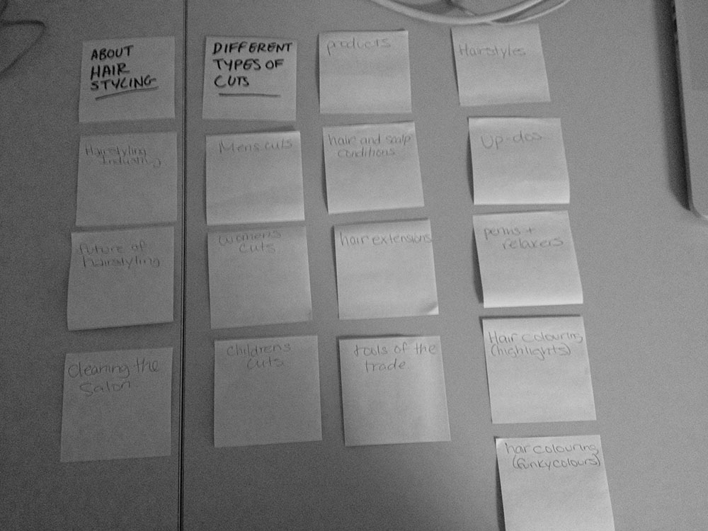
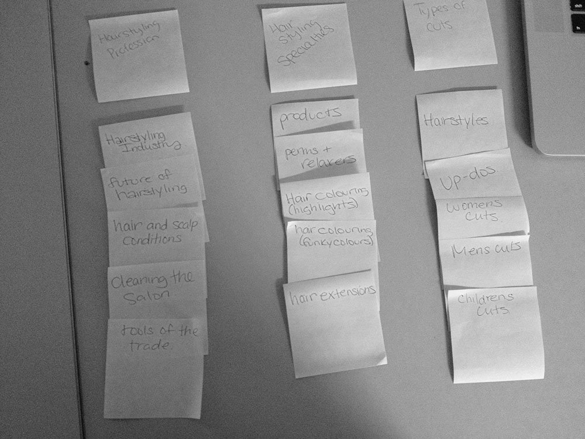

# Card sort report

The purpose of this card sort was to determine common navigation patterns and categories from the content of my Hairstyling web page. (fortheloveofhair.com)

## Specifics

The card sort was conducted by Stephanie Cansfield on September 10th, 2013 between the times of 8:00am-11:00am with the following participants:

- Mansura Chowdbury
- Lisa Beaton

### Cards

15 cards were used covering a broad range of applicable content for the website. The following topics were used as cards: 

1. Hairstyling Industry
2. Future of Hairstyling
3. Hair Styles
4. Hair and Scalp Conditions
5. Retail Products
6. Perms and Relaxers
7. Hair Colouring (Highlights)
8. Hair Colouring (Funky Colours)
9. Hair Extensions
10. Up-Dos
11. Cleaning the Salon
12. Mens Cuts
13. Womens Cuts
14. Childrens Cuts
15. Tools of the Trade

## Card Sort Results

*Card sort 1 by Mansura Chowdbury*

*Card sort 2 by Lisa Beaton*

## Observations

- Did the participants have any common comments?

Both participants felt as though some of my Titles could also be categories so there was confusion with a few of the cards.

- Did they have questions that stood out?

Some common questions were: a) What is a perm and relaxer? and b) What do you mean by "tools of the trade"?

- Did they struggle with certain articles or topics?

Hairstyling isn't an overly complicated topic so overall they both came up with similar categories with little struggle.

- Did they find common groupings? Or were the groupings completely different?

They were similar, Lisa had three categories and Mansura, two. Just Lisa lumped two of Mansura's categories together.

- Were some of the groupings completely unexpected?

I wasn't overly surprised by the way they categorized my topic. 

- Were the results similar to your expectations?

I was thinking the results would be much how they ended up being. I only changed one category.

- How did you feel while watching them perform the task?

I felt they did a good job, and I felt completely certain they would help me categorize my topic; therefore I was very relaxed.
